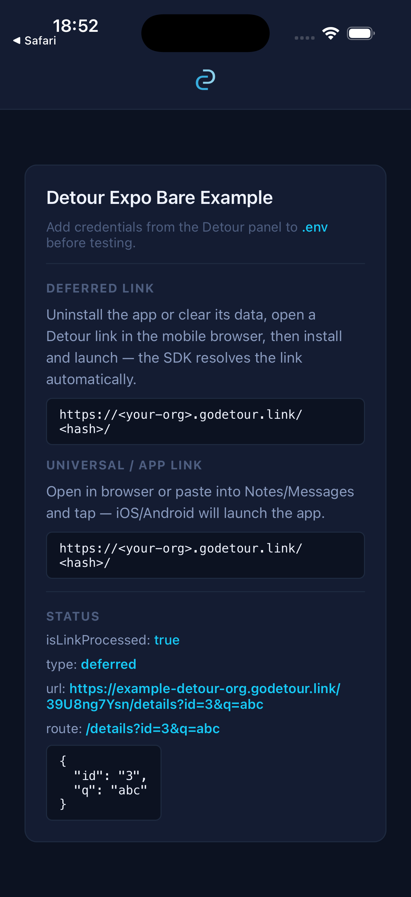
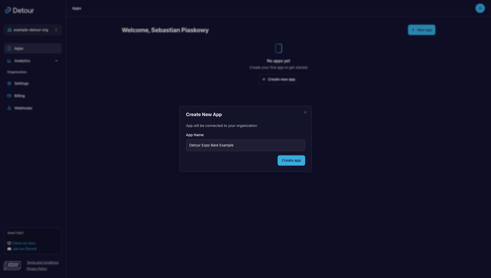
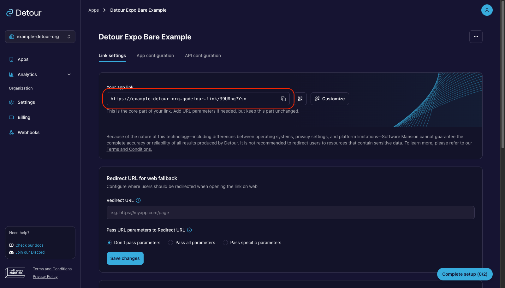
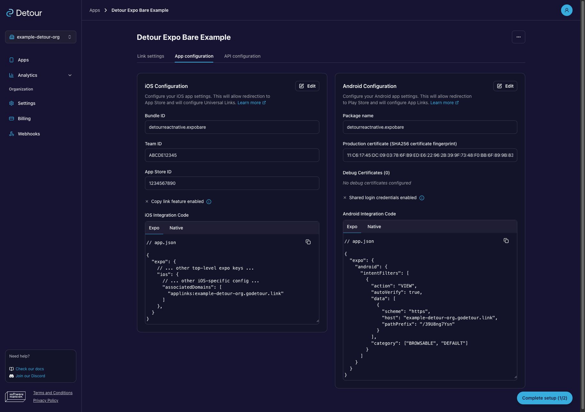
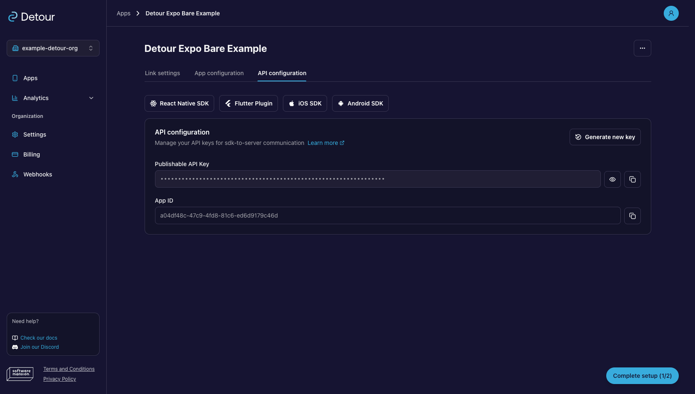

# Detour Expo Bare Example

The most minimal integration of [`@swmansion/react-native-detour`](https://detour.swmansion.com/docs/sdk/react-native/sdk-installation) — no router, no navigation library. `DetourProvider` is initialized with SDK config and a single screen renders the raw `useDetourContext()` state. No router or navigation — the sole purpose is to verify the SDK resolves links correctly before adding your own routing.

Use this as a quick SDK smoke test or base starting point. For a real routing flow, continue with:

- [`examples/expo-router`](../expo-router) — Expo Router
- [`examples/expo-router-advanced`](../expo-router-advanced) — Expo Router, auth-gated
- [`examples/react-navigation`](../react-navigation) — React Navigation

## Test flow

1. Start the app on iOS/Android.
2. Confirm the app renders and `isLinkProcessed` is `false`.
3. Trigger a Detour link (see [Triggering links](#triggering-links)).
4. Confirm `isLinkProcessed` flips to `true` and `type`, `url`, and `route` fields are populated on screen.

<br>

<br>

> _**Resolved link state**. The screen after a Detour link is resolved with `isLinkProcessed: true` and `type`, `url`, and `route` filled in._

## Set up Detour

You need a Detour account to register this app and generate its credentials. [Sign up](https://godetour.dev/auth/signup) and open the [Detour Dashboard](https://godetour.dev). If you run into issues during setup, the [Dashboard Walkthrough](https://detour.swmansion.com/docs/Fundamentals/dashboard) covers each step in detail.

### 1. Register the app

Create an organization and add a new app. Detour assigns it a base link URL of the form `https://<your-org>.godetour.link/<your-app-hash>`.

→ [Dashboard › Apps](https://detour.swmansion.com/docs/Fundamentals/dashboard#apps)


<div style="display: flex; gap: 10px; margin-bottom: 10px">
  
  
</div>

<br>

> **Dashboard**. _Create an organization (top-left), create a new app (top-right), and use the generated link (marked with red) in Link settings (bottom)._


### 2. Configure the platforms

Open **App configuration** and fill in the platform details:

- **iOS:** set Bundle ID to `detourreactnative.expobare`, and provide Team ID and App Store ID. For local development, Team ID and App Store ID can be placeholder values — only the Bundle ID is needed for Universal Links to work locally.
- **Android:** set package name to `detourreactnative.expobare` and add a SHA-256 certificate fingerprint. For local development (`npx expo run:android`), use the **local debug keystore** fingerprint — it is the only Android field required for App Links. See [Testing Android App Links](https://detour.swmansion.com/docs/sdk/react-native/testing#testing-android-app-links).

The dashboard generates the `associatedDomains` and intent-filter snippets to paste into `app.json` ([below](#configuring-appjson)).

> For a production integration, fill all fields with real values. See [App configuration](https://detour.swmansion.com/docs/Fundamentals/getting-started#app-configuration) for full guidance.

→ [Dashboard › App configuration](https://detour.swmansion.com/docs/Fundamentals/dashboard#app-configuration)


<br>

> **Dashboard › App configuration**. _iOS and Android filled configurations with generated integration code snippets ready to copy._

### 3. Copy your credentials

Open **API configuration** and copy your `appID` and publishable `apiKey` into this example's `.env`.

→ [Dashboard › API configuration](https://detour.swmansion.com/docs/Fundamentals/dashboard#api-configuration-and-key-security)


<br>

> **Dashboard › API configuration**. _The API configuration panel with `appID` and the publishable `apiKey` ready to copy._

## Configuring app.json

Replace the placeholders in `app.json` with the values from the dashboard's [App configuration](https://detour.swmansion.com/docs/Fundamentals/dashboard#app-configuration) section:

- `<your-org>` — your organization slug
- `<your-app-hash>` — the path prefix assigned to your app

```json
"ios": {
  "bundleIdentifier": "<your-bundle-identifier>",
  "associatedDomains": ["applinks:<your-org>.godetour.link"]
},
"android": {
  "package": "<your-package>",
  "intentFilters": [{
    "data": [{ "host": "<your-org>.godetour.link", "pathPrefix": "/<your-app-hash>" }]
  }]
}
```

> **Universal Links not opening the app?** Add `?mode=developer` to the `associatedDomains` entry: `"applinks:<your-org>.godetour.link?mode=developer"`. This bypasses Apple's CDN and fetches the AASA file directly from your domain on every launch instead of relying on a potentially stale cached version. Requires **Settings → Developer → Associated Domains Development** to be enabled on the device and a development-signed build. Remove it before submitting to TestFlight or the App Store.

These same values go into the simulator commands in the next section.

## Triggering links

<details>
<summary>Deferred deep link</summary>

Follow these steps to test the deferred flow:

1. Uninstall the app or clear its data to start from a clean state.
2. Open a Detour link in the device's mobile browser.
3. Install and launch the app — the SDK resolves the link automatically.

> **Note:** On Android, the install referrer is typically unavailable in development builds, so deferred matching falls back to probabilistic signals (IP, device fingerprint) only. See [Limitations & Known Issues](https://detour.swmansion.com/docs/Architecture/architecture-limitations).

Alternatively on iOS, you can also copy the link to your clipboard before uninstalling — the SDK reads the clipboard on first launch (`shouldUseClipboard: true`), so you can skip the browser step. It simulates a link clicked before the app was installed.

</details>

<details>
<summary>Universal / App link</summary>

Open a Detour link directly from the terminal:

```sh
# iOS simulator
xcrun simctl openurl booted "https://<your-org>.godetour.link/<your-app-hash>/"

# Android emulator
adb shell am start -a android.intent.action.VIEW -d "https://<your-org>.godetour.link/<your-app-hash>/"
```

Alternatively, paste the link into Notes or Messages on the device and tap it — this uses the same OS routing path a real user would.

</details>

For more cases and gotchas, see [Testing & Troubleshooting](https://detour.swmansion.com/docs/sdk/react-native/testing).

## Quick start

- Install dependencies from the repo root: `pnpm install`
- Configure this app in the [Detour Dashboard](https://godetour.dev) using identifiers from `app.json` (for example `ios.bundleIdentifier`, `android.package`).
- Use the values from the dashboard's [API configuration](https://detour.swmansion.com/docs/Fundamentals/dashboard#api-configuration-and-key-security) section to fill `.env` and update `app.json` with the generated integration code.
- Run prebuild for this example: `pnpm prebuild`
- Start the example: `pnpm start`
- Run on device/simulator: `pnpm ios` or `pnpm android`

## See also

- [`examples/expo-router`](../expo-router) — minimal Expo Router integration
- [`examples/react-navigation`](../react-navigation) — minimal React Navigation integration
- [SDK Usage](https://detour.swmansion.com/docs/sdk/react-native/sdk-usage) — how to integrate Detour with your navigation library
- [API Reference](https://detour.swmansion.com/docs/sdk/react-native/api-reference) — full type and method reference
