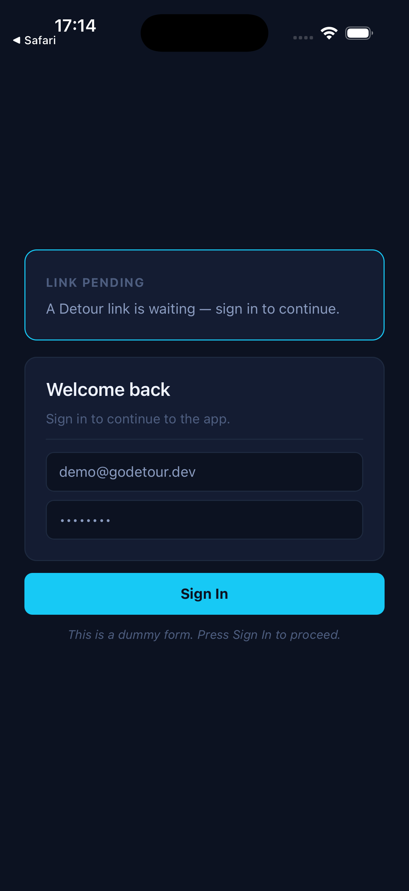
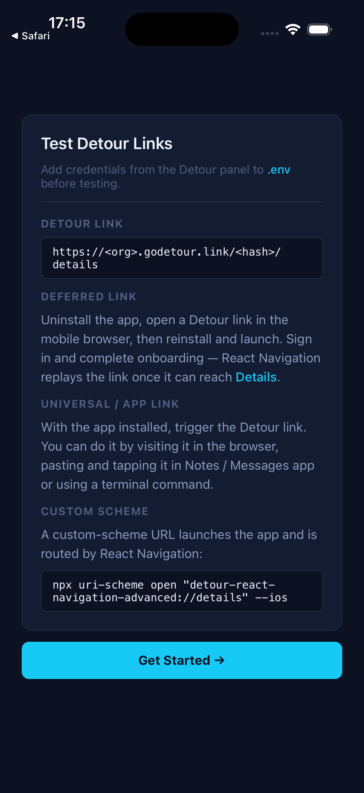
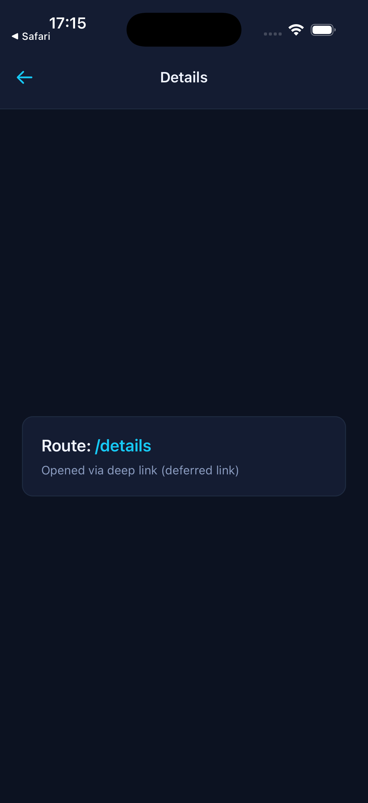
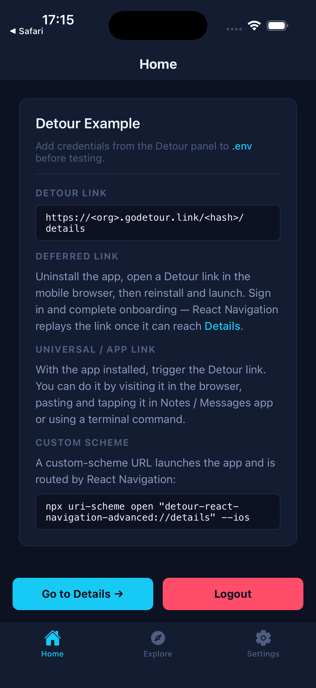
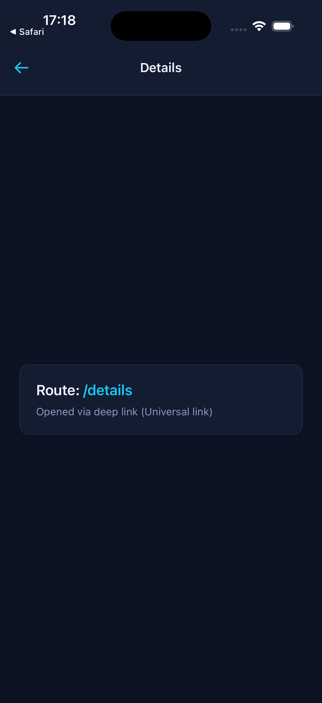
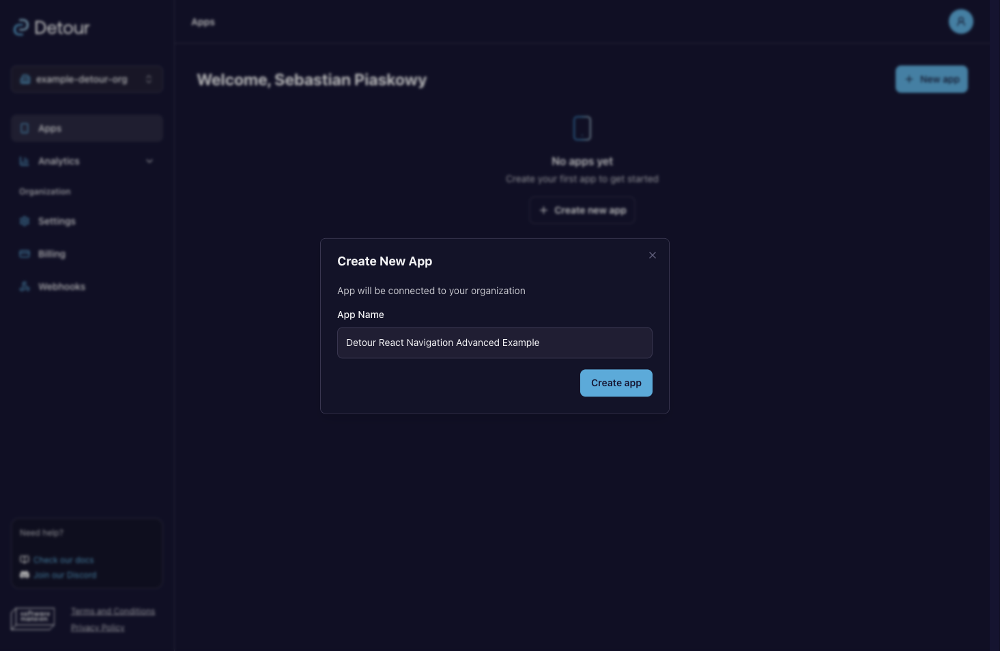
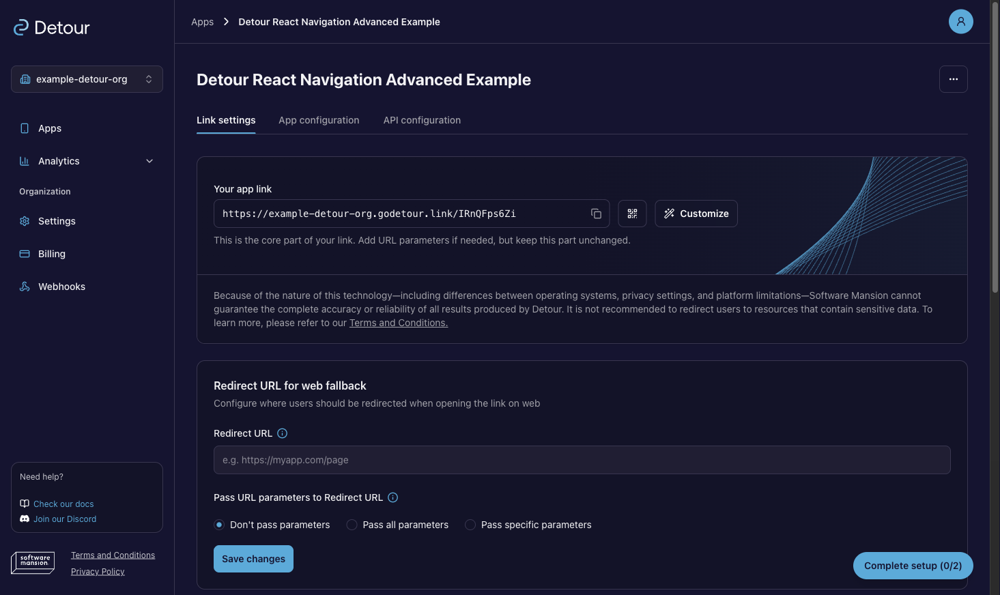
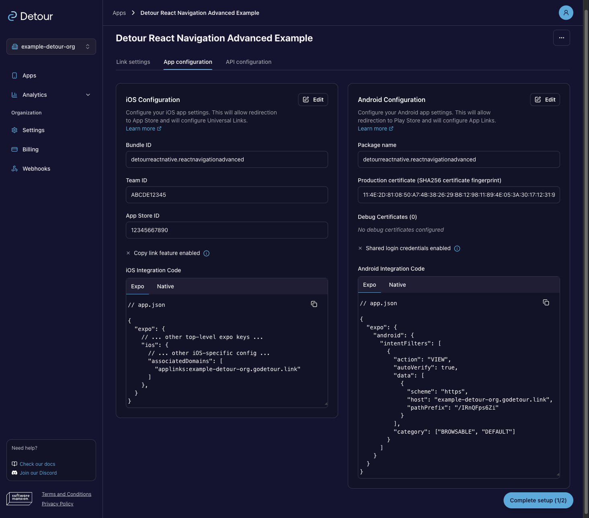
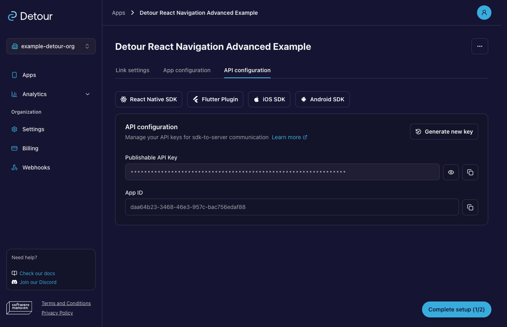
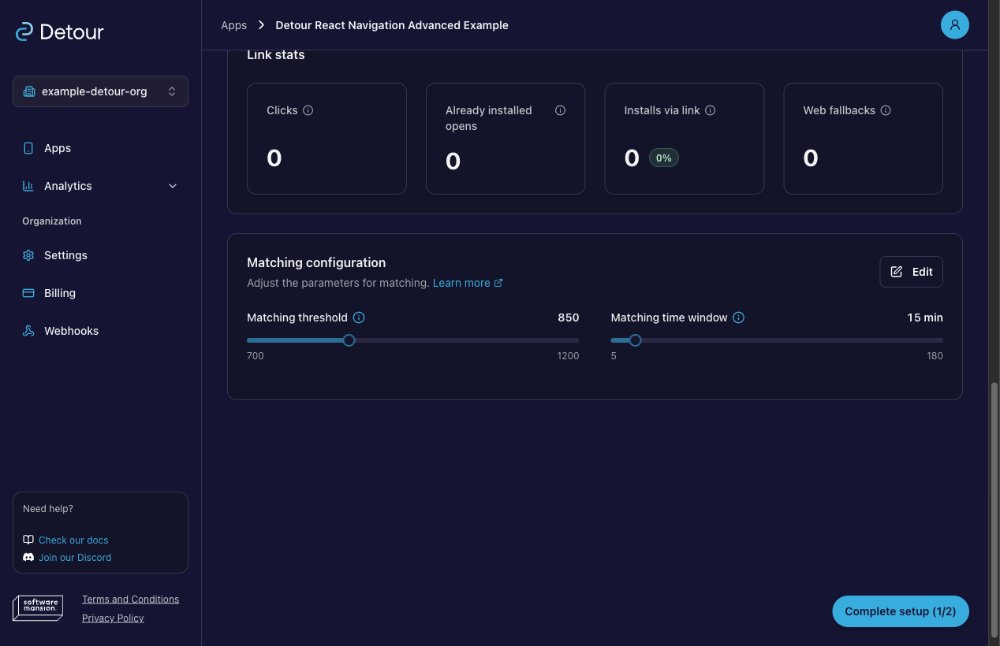

# Detour React Navigation Example (Advanced)

An auth-gated [React Navigation](https://reactnavigation.org/) app with [`@swmansion/react-native-detour`](https://detour.swmansion.com/docs/sdk/react-native/sdk-installation). A deep link can arrive at any point in the `SignIn → Onboarding → Tabs` flow; React Navigation remembers it and replays it once the target screen becomes reachable.

<br>
<div style="display: flex; gap: 10px;">
  
  
  
</div>
<br>

> _**Auth-gated flow**. A Detour link arrives while signed out, so the app waits on the sign-in screen (left) → after signing in, a first-time user goes through onboarding (center) → the pending link is replayed and the app lands on Details (right)._

- Screen flow: `SignIn` → `Onboarding` (once per install) → `Tabs` (Home, Explore, Settings) + `Details`.
- Detour feeds URLs via `Detour.getInitialURL()` and `Detour.addEventListener("url", ...)`.
- `UNSTABLE_routeNamesChangeBehavior="lastUnhandled"` makes React Navigation remember an unresolvable deep link and replay it once the target screen becomes renderable.
- All link types handled: Universal/App links, custom scheme, and deferred.

**Related examples:**

- [`examples/react-navigation`](../react-navigation) — minimal React Navigation integration

## Auth-gated deferred link behavior

<details>
<summary>How a link survives sign-in and onboarding</summary>

- If a deferred link arrives and the user is not signed in, the splash hides and `SignIn` is shown. React Navigation parses the URL, finds `Details` is not currently rendered, and marks the action as the last unhandled one.
- After sign-in, the rendered screen set changes. If onboarding has not been completed yet, `Onboarding` is shown — `Details` is still not rendered, so the pending link stays remembered.
- After onboarding, `Details` becomes part of the rendered stack. React Navigation retries the unhandled action and navigates to `Details` (or falls through to `NotFound`).

> **Note:** `UNSTABLE_routeNamesChangeBehavior="lastUnhandled"` is not deep-link-specific. It also captures other unhandled navigation actions — for example a manual `navigation.navigate(...)` call or an `initialState` pointing at a screen that isn't currently rendered — and replays them once that screen becomes part of the navigator. See the React Navigation docs for the full behavior.

</details>

<details>
<summary>Expected dev-only warning</summary>

When the link arrives while the target screen isn't rendered yet (e.g. on `SignIn`), React Navigation logs a development-only warning.

This is the dispatch attempt against the current (signed-out) navigator state. `UNSTABLE_routeNamesChangeBehavior="lastUnhandled"` then stashes the action and replays it once `Details` is part of the rendered stack. The message is stripped in production builds.

</details>

Reference docs:

→ [React Navigation deep linking](https://reactnavigation.org/docs/deep-linking?config=static#integrating-with-other-tools)

→ [React Navigation auth flow](https://reactnavigation.org/docs/auth-flow) (see `UNSTABLE_routeNamesChangeBehavior`)

## Test flow

1. Start the app — you land on `SignIn` (or `Tabs` if already signed in).
2. Trigger a Detour link to `/details` (see [Triggering links](#triggering-links)) — the link is held while `Details` is not yet in the rendered stack.
3. Sign in — if onboarding hasn't been completed, `Onboarding` is shown next; the link is still remembered.
4. After onboarding, React Navigation replays the link and navigates to `Details`.
5. Go back — the same link should **not** trigger again.

To test the **deferred** case: follow the [Deferred deep link](#triggering-links) setup before installing — the deferred link arrives during `SignIn`, is held through onboarding, and React Navigation replays it to `Details` once the screen becomes reachable.

<div style="display: flex; gap: 10px; margin-bottom: 10px">
  
  
</div>

> _**After sign-in**. The home screen and the `Details` screen triggered by the Universal link._

## Set up Detour

You need a Detour account to register this app and generate its credentials. [Sign up](https://godetour.dev/auth/signup) and open the [Detour Dashboard](https://godetour.dev). If you run into issues during setup, the [Dashboard Walkthrough](https://detour.swmansion.com/docs/Fundamentals/dashboard) covers each step in detail.

### 1. Register the app

Create an organization and add a new app. Detour assigns it a base link URL of the form `https://<your-org>.godetour.link/<your-app-hash>` visible in **Link settings** section.

> In **Link settings**, the dashboard asks for a fallback Redirect URL to mark setup as complete. It only controls where **web** traffic lands — it has no effect on the deferred or Universal/App link flows these examples test, so it can be left empty or filled with a placeholder URL for local development. For production, see [Full app configuration](https://detour.swmansion.com/docs/Fundamentals/getting-started#4-complete-app-configuration).

→ [Dashboard › Apps](https://detour.swmansion.com/docs/Fundamentals/dashboard#apps)

<div style="display: flex; gap: 10px; margin-bottom: 10px">
  
  
</div>

<br>

> **Dashboard**. _Create an organization (top-left), create a new app (top-right), and use the generated link (marked with red) in Link settings (bottom)._


### 2. Configure the platforms

Open **App configuration** and fill in the platform details:

- **iOS:** set Bundle ID to `detourreactnative.reactnavigationadvanced` and provide Team ID and App Store ID. The **Team ID must be your real Apple Developer Team ID** — the one the build is signed with (`DEVELOPMENT_TEAM` in Xcode › Signing & Capabilities, also shown under [Apple Developer › Membership](https://developer.apple.com/account)). A placeholder or mismatched Team ID makes the Universal link open in Safari instead of the app. The App Store ID can stay a placeholder for local development.
- **Android:** set package name to `detourreactnative.reactnavigationadvanced` and add a SHA-256 certificate fingerprint. The **fingerprint must match the keystore that signs the build** — a wrong value makes Android open the App link in the browser instead of the app. For local development (`npx expo run:android`), use the **local debug keystore** fingerprint. See [Testing Android App Links](https://detour.swmansion.com/docs/sdk/react-native/testing#testing-android-app-links) for more info.

The dashboard generates the `associatedDomains` and intent-filter snippets to paste into `app.json` ([below](#configuring-appjson)).

> For a production integration, fill all fields with real values. See [App configuration](https://detour.swmansion.com/docs/Fundamentals/getting-started#app-configuration) for full guidance.

→ [Dashboard › App configuration](https://detour.swmansion.com/docs/Fundamentals/dashboard#app-configuration)


<br>

> **Dashboard › App configuration**. _iOS and Android filled configurations with generated integration code snippets ready to copy._


### 3. Copy your credentials

Open **API configuration** and copy your `appID` and publishable `apiKey` into this example's `.env`.

→ [Dashboard › API configuration](https://detour.swmansion.com/docs/Fundamentals/dashboard#api-configuration-and-key-security)


<br>

> **Dashboard › API configuration**. _The API configuration panel with `appID` and the publishable `apiKey` ready to copy._

### 4. (Optional) Tune deferred-link matching

Because this example exercises the deferred case through a multi-step gate, you may want to review the **Matching** settings (threshold and time window) that control how a pre-install click is paired with the first launch.

→ [Matching](https://detour.swmansion.com/docs/Architecture/matching)


<br>

> **Dashboard › Link Settings › Matching**. _The matching panel showing confidence threshold and time-window controls alongside match statistics._

## Configuring app.json

Replace the placeholders in `app.json` with the values from the dashboard's [App configuration](https://detour.swmansion.com/docs/Fundamentals/dashboard#app-configuration) section:

- `<your-org>` — your organization slug
- `<your-app-hash>` — the path prefix assigned to your app

```json
"ios": {
  // ...
  "associatedDomains": ["applinks:<your-org>.godetour.link"]
},
"android": {
  // ...
  "intentFilters": [{
    // ...
    "data": [{ "scheme": "https", "host": "<your-org>.godetour.link", "pathPrefix": "/<your-app-hash>" }]
  }]
}
```

> **Universal Links not opening the app?** Add `?mode=developer` to the `associatedDomains` entry: `"applinks:<your-org>.godetour.link?mode=developer"`. This bypasses Apple's CDN and fetches the AASA file directly from your domain on every launch instead of relying on a potentially stale cached version. Requires **Settings → Developer → Associated Domains Development** to be enabled on the device and a development-signed build. Remove it before submitting to TestFlight or the App Store.

These same values go into the simulator commands in the next section.

## Triggering links

<details>
<summary>Deferred deep link</summary>

Follow these steps to test the deferred flow:

1. Uninstall the app or clear its data to start from a clean state.
2. Open a Detour link in the device's mobile browser.
3. Install and launch the app — the SDK resolves the link automatically.

> **Note:** On Android, the install referrer is typically unavailable in development builds, so deferred matching falls back to probabilistic signals (IP, device fingerprint) only. See [Limitations & Known Issues](https://detour.swmansion.com/docs/Architecture/architecture-limitations).

Alternatively on iOS, you can also copy the link to your clipboard before uninstalling — the SDK reads the clipboard on first launch (`shouldUseClipboard: true`), so you can skip the browser step. It simulates a link clicked before the app was installed.

</details>

<details>
<summary>Universal / App link</summary>

Open a Detour link directly from the terminal:

```sh
# iOS simulator
xcrun simctl openurl booted "https://<your-org>.godetour.link/<your-app-hash>/details"

# Android emulator
adb shell am start -a android.intent.action.VIEW -d "https://<your-org>.godetour.link/<your-app-hash>/details"
```

Alternatively, paste the link into Notes or Messages on the device and tap it — this uses the same OS routing path a real user would.

</details>

<details>
<summary>Custom scheme</summary>

```sh
# iOS simulator
npx uri-scheme open "detour-react-navigation-advanced://details" --ios

# Android emulator
npx uri-scheme open "detour-react-navigation-advanced://details" --android
```

</details>

For more cases and gotchas, see [Testing & Troubleshooting](https://detour.swmansion.com/docs/sdk/react-native/testing).

## Quick start

- Install dependencies from the repo root: `pnpm install`
- Configure this app in the [Detour Dashboard](https://godetour.dev) using identifiers from `app.json` (for example `ios.bundleIdentifier`, `android.package`).
- Use the values from the dashboard's [API configuration](https://detour.swmansion.com/docs/Fundamentals/dashboard#api-configuration-and-key-security) section to fill `.env` and update `app.json` with the generated integration code.
- Run prebuild for this example: `pnpm prebuild`
- Start the example: `pnpm start`
- Run on device/simulator: `pnpm ios` or `pnpm android`

## See also

- [Deferred deep linking blog series](https://swmansion.com/blog/integrating-deferred-deep-linking-in-react-native-apps-1/) — background on the technique
- [SDK Usage](https://detour.swmansion.com/docs/sdk/react-native/sdk-usage) — how to integrate Detour with your navigation library
- [API Reference](https://detour.swmansion.com/docs/sdk/react-native/api-reference) — full type and method reference
- [`examples/react-navigation`](../react-navigation) — minimal React Navigation integration
